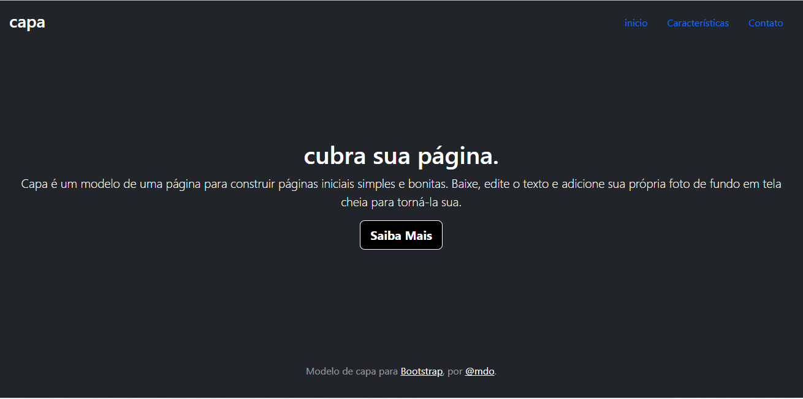
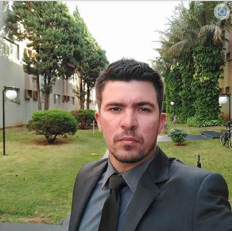

[projeto - portifolio para escrita do readme](#projeto---portifolio-para-escrita-do-readme)

[descrição](#descri%C3%A7%C3%A3o)  

[funcionalidades](#funcionalidades)

[tecnologias utilizadas](#tecnologias-utilizadas)

[fontes consultadas](#fontes-consultadas)

[altores](#altores)

# 🚀 projeto - portifolio para escrita do readme

## 📋  descrição
 o site e como se foçe uma capa

## 🔧funcionalidades
o site funciona como uma capa

### 🛠️tecnologias utilizadas
html css readme github vs code google e bootstarp

## 📄fontes consultadas 
googleebootstrap

## ✒️altores

